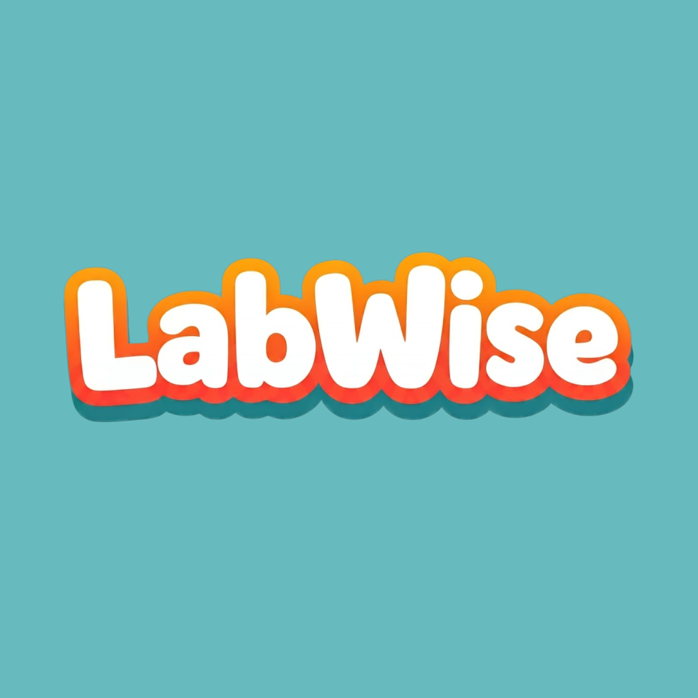
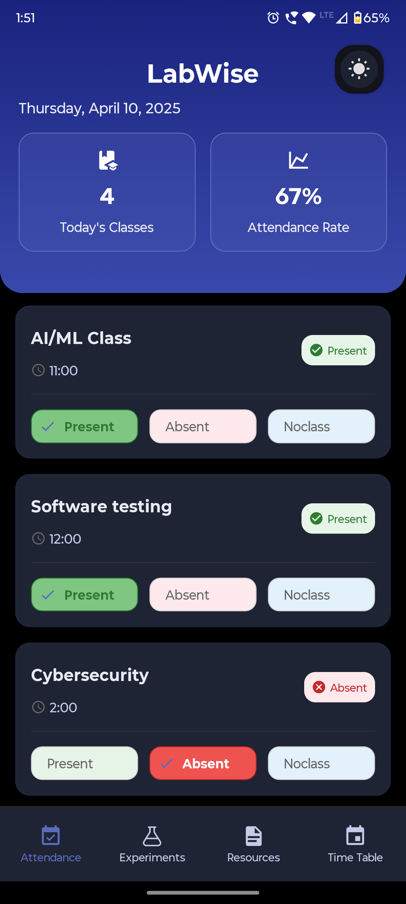
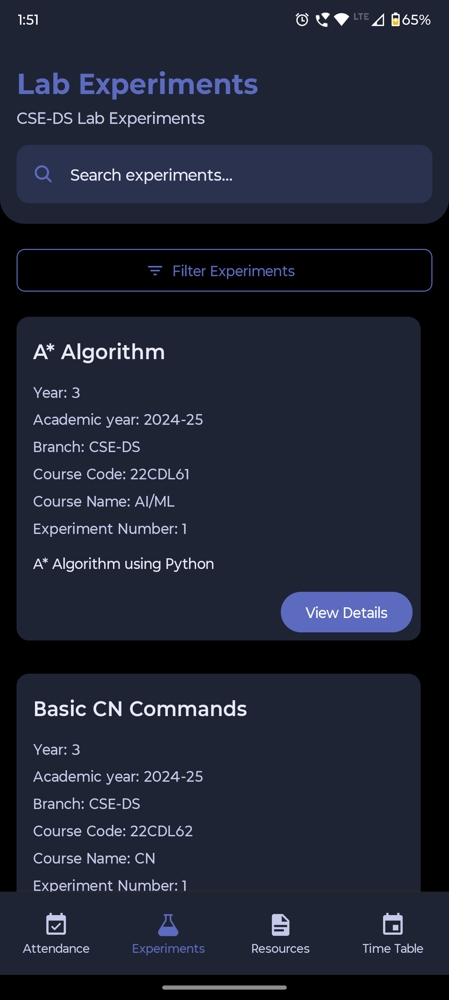
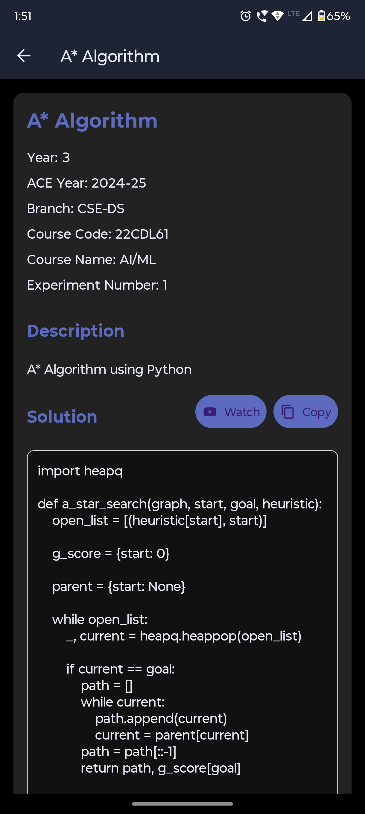
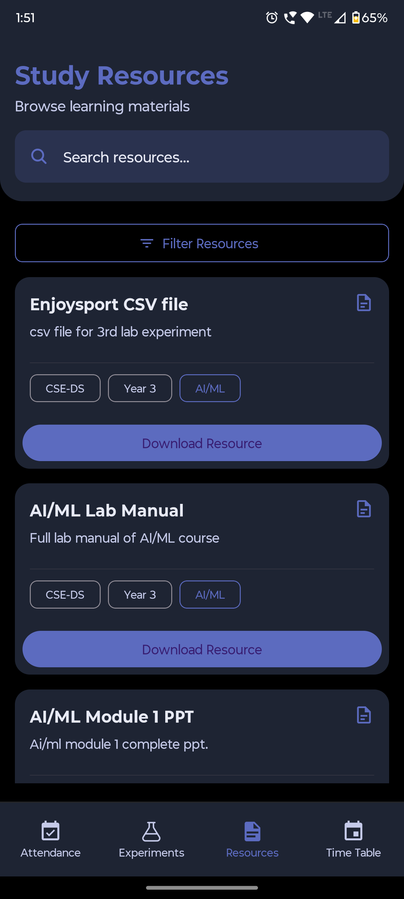
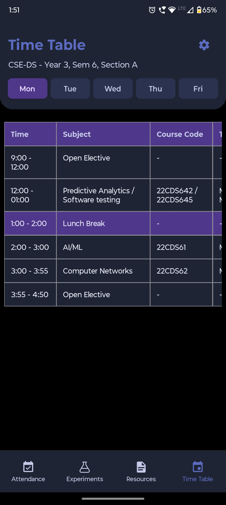

# LabWise

<p align="center">
  
</p>

## A Comprehensive Lab Management & Attendance Tracking App for NHCE Students

LabWise is a full-featured React Native mobile application designed specifically for NHCE (New Horizon College of Engineering) Computer Science and Engineering - Data Science students. It serves as an all-in-one platform for managing lab experiments, tracking class attendance, and accessing academic resources.

---

## 📱 App Screenshots

<p align="center">
  
  
  
  
  
</p>

---

## 🚀 Features

### 🧪 Lab Experiments Module

- **Comprehensive Experiment Repository**: Access a complete collection of CSE-DS lab experiments
- **Advanced Filtering & Search System**: Filter by branch, year, and course; search by name or description
- **Experiment Details**: Each experiment includes:
  - Experiment name and number
  - Course details (code, name)
  - Year and branch information
  - Detailed description
  - Step-by-step solution with code snippets
- **Markdown Rendering**: Proper formatting of code blocks and technical content
- **Code Solutions**: Easily copy solutions to clipboard with proper formatting
- **YouTube Integration**: Watch experiment demonstrations via embedded links
- **Sorting Options**: Sort experiments by number, name, or year

### 📅 Attendance Tracking System

- **Daily Schedule View**: Automatically displays today's classes based on weekday
- **Status Tracking**: Mark classes as Present, Absent, or No Class with toggle functionality
- **Visual Status Indicators**: Color-coded attendance status (green for present, red for absent)
- **Statistics Dashboard**: Track overall attendance percentage
- **Calendar View**: Visualize attendance patterns across the semester
- **Attendance Analytics**: View detailed statistics for each course

### ⚙️ Course Management

- **Custom Course Creation**: Add courses with detailed schedule information
- **Time Slot Management**: Assign specific days and times for each course
- **Course Editing**: Update course details as needed
- **Persistence**: All course data saved locally for offline access

### 🎨 UI/UX Features

- **Responsive Design**: Optimized for various screen sizes
- **Dark/Light Theme**: Toggle between dark and light modes for comfortable viewing
- **Material Design 3**: Modern UI following Material Design guidelines
- **Smooth Animations**: Enhanced user experience with subtle transitions
- **Pull-to-Refresh**: Update data with intuitive pull gesture
- **Bottom Tab Navigation**: Easy access to main app sections
- **Modal Dialogs**: Clean interfaces for filters and data entry
- **Custom Cards**: Information displayed in visually appealing card components

---

## 🛠️ Technical Implementation

### Architecture

LabWise follows a modular architecture with the following key components:

- **Navigation**: Uses Expo Router for type-safe navigation with file-system based routing
- **State Management**: Combines React context and local component state
- **Data Persistence**: AsyncStorage for local data storage
- **UI Components**: React Native Paper for Material Design components
- **API Integration**: Fetches experiment data from a custom backend

### Technology Stack

- **Frontend Framework**: React Native with Expo
- **Language**: TypeScript for type safety
- **UI Library**: React Native Paper
- **Navigation**: Expo Router
- **Styling**: StyleSheet API with theme context
- **Icons**: Expo Vector Icons (Material Community Icons, Ionicons)
- **Animations**: React Native Reanimated
- **Storage**: AsyncStorage
- **API Communication**: Custom API (labwise Web)
- **Content Rendering**: Markdown display for formatted content

### Code Organization

```
LabWise/
├── app/               # Main application code (Expo Router)
│   ├── (tabs)/        # Tab-based screens
│   │   ├── index.tsx  # Home/Attendance screen
│   │   ├── two.tsx    # Experiments list screen
│   │   └── _layout.tsx # Tab navigation configuration
│   ├── experiment/    # Experiment detail screens
│   │   └── [id].tsx   # Dynamic route for experiment details
│   ├── attendance/    # Attendance related screens
│   └── _layout.tsx    # Root layout with themes
├── components/        # Reusable UI components
├── context/           # React context providers
│   └── ThemeContext.tsx # Theme management
├── types/             # TypeScript type definitions
└── assets/            # Static assets (images, fonts)
```

---

## 💡 Key Technical Challenges & Solutions

### Challenge 1: Efficient Data Filtering and Search

**Solution:** Implemented a multi-layered filtering system:

- Server-side filtering for branch and year parameters
- Client-side filtering for search queries and course names
- Custom hooks for memoized filter operations to minimize re-renders

### Challenge 2: Theme Management

**Solution:** Created a custom ThemeContext that:

- Manages dark/light mode transitions
- Provides consistent theming across all components
- Integrates with both React Navigation and React Native Paper

### Challenge 3: Optimized List Rendering

**Solution:** Enhanced performance through:

- Virtualized lists with FlatList
- Memoization of list items and render functions
- Animated layout transitions for smooth UX
- Windowing techniques to render only visible items

### Challenge 4: Markdown Code Rendering

**Solution:** Built a custom solution that:

- Properly formats and displays code blocks with syntax highlighting
- Handles HTML entities and special characters
- Provides clean copying functionality preserving formatting

---

## 🔍 What I Learned

- **React Native Best Practices**: Optimizing performance on mobile devices
- **State Management Patterns**: Effective state organization in complex apps
- **UI/UX Design Principles**: Creating intuitive and visually appealing interfaces
- **TypeScript Advanced Features**: Using TypeScript for safer code
- **Expo Ecosystem**: Leveraging Expo tools for rapid development
- **Material Design Implementation**: Applying design systems consistently

---

## 🚀 Future Enhancements

- **Cloud Sync**: Synchronize data across devices
- **Notifications**: Reminders for upcoming classes and experiments
- **Collaborative Features**: Share notes with classmates
- **Academic Calendar**: Integration with college calendar
- **Performance Analytics**: Track academic performance over time
- **Offline PDF Generation**: Create attendance and experiment reports

---

## 🔧 Installation and Setup

```bash
# Clone the repository
git clone https://github.com/yourusername/labwise.git

# Navigate to the project directory
cd labwise

# Install dependencies
npm install

# Start the development server
npx expo start
```

## 📱 Building for Production

```bash
# Build for Android
eas build -p android

# Build for iOS
eas build -p ios
```

---

## 👨‍💻 About the Developer

LabWise was designed and developed by Amit Acharya, a passionate developer with a focus on creating tools that solve real educational problems. The app was built to address the specific needs of NHCE CSE-DS students, providing them with a streamlined way to manage their academic life.

For issues or feature requests, please email: amit.acharya.work@gmail.com

---

## 📄 License

This project is licensed under the MIT License - see the LICENSE file for details.

---

<p align="center">
  Made with ❤️ for NHCE Students
</p>
